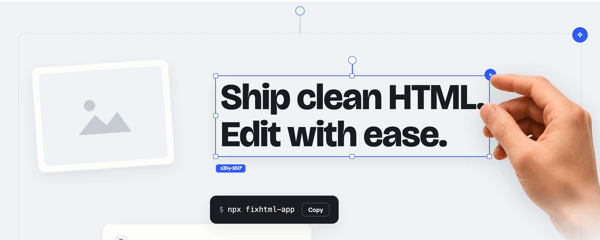
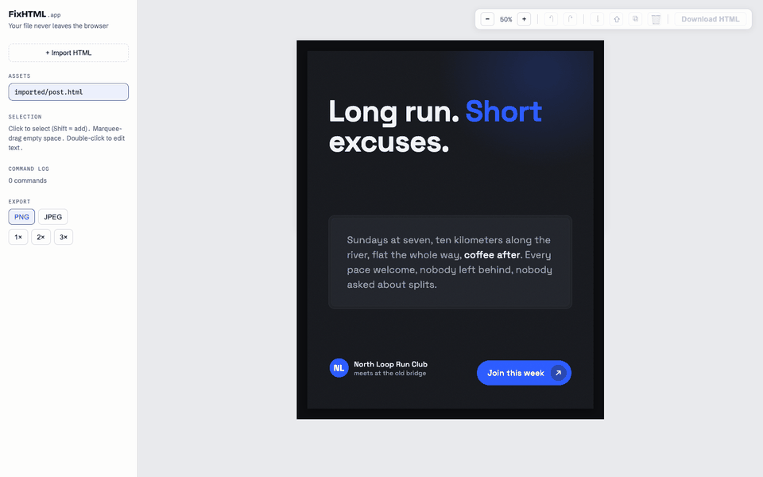

<div align="center">

[](https://fixhtml.app)

[](https://www.npmjs.com/package/fixhtml-app)
[](./LICENSE)
[](https://fixhtml.app)
[](./skills/fixhtml)

</div>

# FixHTML

**Edit AI-generated HTML like Canva — then keep the HTML.** Drop a slide, carousel, or
social card into a visual editor, drag / resize / rotate / rewrite text, and every change
saves back into the same HTML file. Export a pixel-perfect PNG when you're done.

**[Try it in your browser → fixhtml.app](https://fixhtml.app)** · no install, your file
never leaves the tab.



## Quick start

```bash
npx fixhtml-app slide.html                 # open a file in the visual editor (saves back into it)
npx fixhtml-app                            # serve the current folder; pick a file to edit
npx fixhtml-app export slide.html --scale 2   # headless: write a 2× PNG (2160×2700 for a 1080×1350 asset)
```

First run downloads the package via `npx` (a few seconds). Nothing is uploaded — the editor
runs on your machine. Export uses Chromium; if it isn't installed the command tells you to run
`npx playwright install chromium`.

## What it does

- **Direct manipulation** — drag, resize, 8-handle scale, rotate, with edge/center snapping
  and alignment guides. Multi-select with a marquee.
- **Text & structure** — double-click to edit text (nested `<em>`/`<strong>` preserved),
  z-order, duplicate, delete, full undo/redo.
- **HTML stays the source of truth** — edits replay onto your original file; no lock-in, no
  proprietary format, no editor cruft in the output.
- **Pixel-perfect export** — PNG/JPEG at 1×/2×/3×, one file per page, transparency preserved.
- **Font fidelity** — imported fonts that would silently fall back are flagged; fix them by
  uploading the file or matching it on Google Fonts, and the fix travels in the saved HTML and
  the export.
- **Brand tokens (local studio)** — a `brand.json` compiles to CSS custom properties and
  self-hosted `@font-face`, so generated assets stay on-brand in the editor and the export.

## Use with agents

FixHTML is **agent-agnostic** — the handoff is a plain shell command, so it works with any
coding agent (Claude Code, Codex, Cursor, Copilot, Gemini CLI, …): the agent generates
`slide.html` → you run `npx fixhtml-app slide.html` and fix it visually → your edits **save back
into the same file** → the agent keeps iterating from the polished version. Concurrent writes
are safe: if the agent rewrites the file while you have it open, your next save shows a
**Reload / Overwrite** prompt (an mtime guard) rather than a silent clobber. Agents that can
run shell commands can also export images themselves, headlessly.

**Teach your agent the handoff** — paste this into its instructions file (`AGENTS.md`,
`CLAUDE.md`, `.cursorrules`, `.github/copilot-instructions.md`, `GEMINI.md` — the same block
works everywhere):

```markdown
## Editing HTML design assets
When I want to visually edit, reposition, resize, rotate, or restyle a rendered HTML asset
(a slide, carousel slide, social card, poster), hand off to the local editor: tell me to run
`npx fixhtml-app <file.html>` — I drag/resize/rotate/edit text and every change saves back into
the file. Then re-read the file and continue from my edits. You can also export an image
yourself: `npx fixhtml-app export <file.html> --scale 2`. If you rewrite the file while I have it
open, my next save prompts Reload/Overwrite — don't assume a silent overwrite.
```

**Or install the bundled skill** — the `SKILL.md` format is shared across agents, so the
same skill works in Claude Code *and* Codex CLI; only the install path differs:

```bash
cp -r skills/fixhtml ~/.claude/skills/    # Claude Code   (project: .claude/skills/)
cp -r skills/fixhtml ~/.codex/skills/     # Codex CLI     (project: .codex/skills/)
```

With the skill installed, asking your agent to visually edit or export an HTML asset
offers the `npx fixhtml-app <file>` handoff automatically, and the agent can run
`npx fixhtml-app export` itself. Packaged rules for other agents (Cursor, Copilot, Gemini)
are welcome as contributions — the snippet above is the content.

## How it works

FixHTML edits an **asset contract** — a light convention any HTML can be lifted into:

- One fixed-size artboard per page, **any size, any orientation**:
  `<div class="hs-page" data-size="1080x1350">` (an Instagram portrait here — a landscape
  dashboard would be e.g. `data-size="1920x1080"`). Freeze pins imported free-form HTML at
  its native rendered size; export is always `data-size` × scale.
- Direct children are absolutely-positioned objects: `<div class="hs-el" style="left/top/width/transform">`.
- Position / size / rotation live in inline styles on `.hs-el`; everything else stays in your
  classes and CSS.

Free-form HTML (a flexbox slide, a one-container AI export) is converted with a one-click
**freeze** that measures each block's rendered box and pins it — verified pixel-identical to
the original. The editor records **one command per gesture** and replays the log onto a
pristine copy of your file on save, so the output is your HTML plus the edits and nothing else.

There are two build targets from one codebase: the **browser demo** (what fixhtml.app serves —
everything in the tab, snapdom export) and the **local studio** / CLI (a Node server with real
file storage and Playwright export). See [DEVLOG.md](./DEVLOG.md) for the full build journal
and the engineering decisions behind each of these.

## Run from source

```bash
npm install
npm run dev          # local studio: editor http://localhost:5173, server :5174
npm run build        # prebuilt frontend -> dist/ (what the CLI serves)
npm run build:demo   # browser-only demo build -> dist-demo/ (what fixhtml.app serves)
npm run fonts        # sync the self-hosted font library (local studio)
```

```
app/                  React + Vite + TS editor frontend (both build targets)
  src/App.tsx          asset list, iframe, command log, save, import inlets, style panel
  src/adapter.ts       backend-adapter interface: LocalAdapter (server) / BrowserAdapter (demo)
  src/iframeRuntime.js runs inside the iframe: Moveable, selection, marquee, freeze, commands
  src/assetEdit.ts     command-log types, eid derivation, replay-onto-pristine save
server/index.mjs       createApp(): serves assets/ + brands/ + fonts/; /api; ?edit=1 edit view
server/export.mjs      Playwright PNG/JPEG export (local build; optional Chromium)
bin/fixhtml.mjs        the npx CLI (serve / open a file / headless export)
skills/fixhtml/        the agent skill (Claude Code + Codex, shared SKILL.md)
brands/demo/           example brand.json + compiled tokens.css/BRAND.md
assets/                contract + free-form fixtures
```

## License

MIT — see [LICENSE](./LICENSE).
